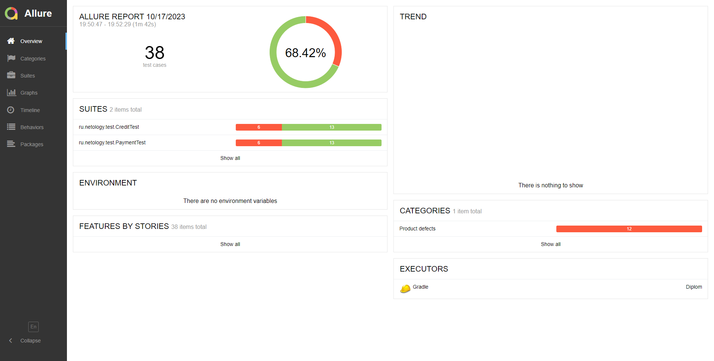

# Отчёт о тестировании
## Описание:
При работе надо проектом было проведено ручное и автоматизированое тестирование веб-сервиса "Путешествие дня", работавший совместо с СУБД и API банка.

- Общее количество тест-кейсов: 38

- Количество оформленных баг-репортов 7 (для вкладки "Купить" и "Купить в кредит" баг-репорты одинаковые)
## Отчёт автотестов Allure 

- Общее количество тест-кейсов:38
- Успешных тест-кейсов:24
- Процент успешных тест-кейсов:63.15%
- Упавших тест-кейсов:14
- Процент упавших тест-кейсов:36.85%
## Отчёт автотестов Gradle

- Общее количество тест-кейсов:38
- Успешных тест-кейсов:24
- Процент успешных тест-кейсов:63.15%
- Упавших тест-кейсов:14
- Процент упавших тест-кейсов:36.85%
## Общие рекомендации 
- Необходимо разработать документацию
- Для поля "Владелец" добавить ограничение на использование только латинской раскладки.
- В поле "Номер карты", "Месяц", "Год" "CVC\CVV", нужно внести валидацию если в эти поля ввести значение, равное 0 не появляются валидационные сообщения об ошибке под полями ввода.
- Поправить текст на главной странице, ошибка в тексте название города "Марракэш"